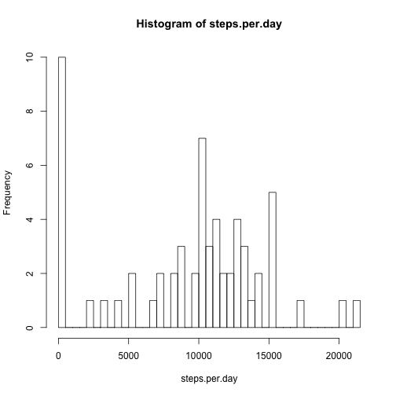
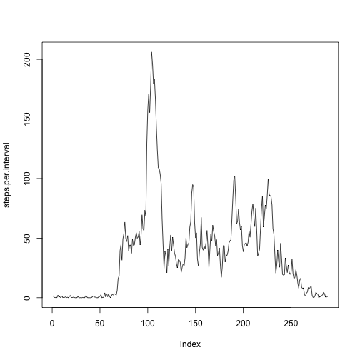
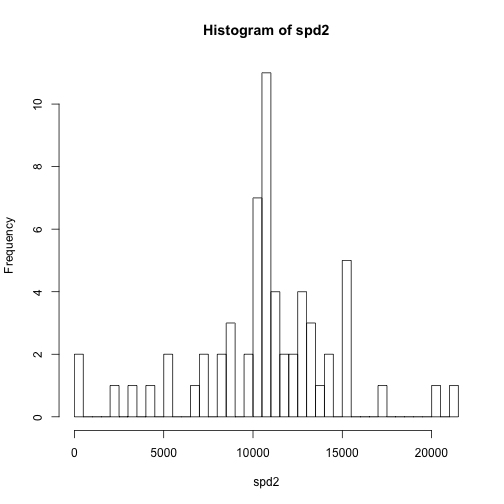
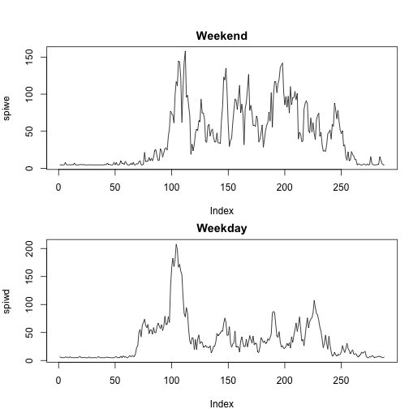

## Loading and preprocessing the data
### 1. Load the data  

```r
x<-read.csv("activity.csv")
```

### 2. Process/transform the data (if necessary) into a format suitable for your analysis

```r
x$date1<-as.Date(x$date, "%Y-%m-%d")
```

-----
## What is mean total number of steps taken per day?
### 1. Calculate the total number of steps taken per day

```r
steps.per.day<-tapply(x$steps, x$date, sum, na.rm = TRUE)
```

### 2. Make a histogram of the total number of steps taken each day

```r
hist(steps.per.day, breaks = 61)
```

 

### 3. Calculate and report the mean and median total number of steps taken per day

```r
mu1<-mean(steps.per.day, na.rm = TRUE)
med1<-median(steps.per.day, na.rm = TRUE)
```
#### The mean number of steps taken per day is 9354.2295082, and the median number of step taken per day is 10395.

-----
## What is the average daily activity pattern?
### 1. Make a time series plot

```r
steps.per.interval<-tapply(x$steps,x$interval,mean,na.rm=TRUE)
plot(steps.per.interval, type = "l")
```

 

### 2. Which 5-minute interval, on average across all the days in the dataset, contains the maximum number of steps?

```r
maxinterval<-which.max(steps.per.interval)
```
#### The maximum number of steps is at 104.
-----
## Imputing missing values
### 1. Calculate and report the total number of missing values in the dataset 

```r
x$missteps<-is.na(x$steps)
totalmissing<-sum(x$missteps)
```

### 2. Devise a strategy for filling in all of the missing values in the dataset.
### 3. Create a new dataset that is equal to the original dataset but with the missing data filled in.

```r
x2<-x
library(Hmisc)
x2$steps<-impute(x$steps, fun=mean)
```

### 4. Make a histogram of the total number of steps taken each day and Calculate and report the mean and median total number of steps taken per day

```r
spd2<-tapply(x2$steps, x2$date, sum, na.rm = TRUE)
hist(spd2, breaks = 61)
```

 

```r
mu2<-mean(spd2, na.rm = TRUE)
med2<-median(spd2, na.rm = TRUE)
```
#### The mean and median total number of steps taken per day are 1.0766189 &times; 10<sup>4</sup> and 1.0766189 &times; 10<sup>4</sup>, both differ from the mean and median derivated from the original dataset. Both the new mean and median are larger than the original ones.

-----
## Are there differences in activity patterns between weekdays and weekends?
### 1. Create a new factor variable in the dataset with two levels – “weekday” and “weekend” indicating whether a given date is a weekday or weekend day.

```r
x2$weekday<-as.factor(ifelse(weekdays(x2$date1) %in% c("Saturday", "Sunday"), "Weekend", "Weekday"))
```

### 2. Make a panel plot containing a time series plot

```r
x2wd<-x2[x2[,"weekday"]=="Weekday",]
x2we<-x2[x2[,"weekday"]=="Weekend",]
spiwd<-tapply(x2wd$steps,x2wd$interval,mean,na.rm=T)
spiwe<-tapply(x2we$steps,x2we$interval,mean,na.rm=T)
par(mfrow = c(2,1), mar = c(4,4,2,1), oma = c(0,0,2,0))
plot(spiwe, type = "l", main = "Weekend")
plot(spiwd, type = "l", main = "Weekday")
```

 
#### The activity pattern appears to be different between weekdays and weekends. In weekdays there are several peaks that are distinct from other time of the day, while in weekends the general level of activity is higher and more peaks are clustered together.

